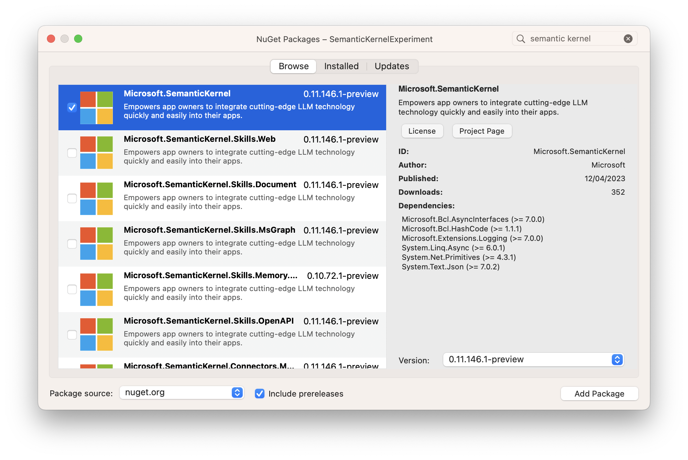

# semantic-kernel-experiment

The [Semantic Kernel](https://learn.microsoft.com/en-us/semantic-kernel/whatissk) is a .NET SDK that simplifies a number of machine learning tasks.


This solution is fully commented, and illustrates a simple use of the Semantic Kernel:

* Defines 1 or more skills, each with 1 or more functions
* Creates a plan from an ask presented to the Kernel
* Executes that plan, to get to a final result

## Configuration

Config is stored in 2 files:

* `SKE/.env` - configuration specifying `serviceId` and `modelId`
* `SKE/.secret.env` - configuration specifying your secret `apiKey`

You'll need to create `SKE/.secret.env` file and provide your API key from OpenAI:

```env
apiKey=<your-key-goes-here>
```

### OpenAI vs. Azure OpenAI

NB. The solution is currently set up to use text completion services from OpenAI. Semantic Kernel can also access similar services through Azure OpenAI - you'll need to modify the code a little to do that... It's the difference between this:

```csharp
kernel.Config.AddOpenAITextCompletionService(serviceId, modelId, apiKey, orgId);
```
and this:

```csharp
kernel.Config.AddAzureOpenAITextCompletionService(serviceId, modelId, azureEndpoint, apiKey);
```

## Getting started

* Place an API key from your OpenAI subscription in `.secret.env`
* Run the application:

  ```sh
  dotnet run --project SKE/SKE.csproj
  ```

## Skills, Functions, and the Planner

You can define any number of [semantic functions](https://learn.microsoft.com/en-us/semantic-kernel/howto/semanticfunctions) and [native functions](https://learn.microsoft.com/en-us/semantic-kernel/howto/nativefunctions), and these are bundled into groups called skills.

Each skill is found in its own directory, and in this solution these are all grouped inside the `Skills/` directory.

You can invoke functions directly through the Kernel, or use the Planner - a special skill that can determine which functions to use to fulfil an ask you make of it.

`KernelSkillsExtensions.cs` provides a number of helpful utility methods for importing skills, importing the planner, and then using it to create a plan and execute it.

## Creating skills

To add a new semantic function, create the directory structure for it: `Skills/<skill-name>/<function-name>`

Then, add the `skprompt.txt` prompt file, and (optionally) a `config.json` file for the function itself:

* `Skills/<skill-name>/<function-name>/skprompt.txt`
* `Skills/<skill-name>/<function-name>/config.json`

_NB. Ensure that your `skprompt.txt` and `config.json` files are copied alongside the compiled binary by setting their "copy to output directory" property._

To add native functions, create the skill directory, and then a C# class file inside that skill directory. Provide each method that you wish to import as a native function with the `SKFunction` attribute, and provide a description of the function as its parameter, eg.

```csharp
public class CharacterManipulationSkill
{
    [SKFunction("Return the text in all uppercase (aka capitals)")]
    public string Uppercase(string input)
        => input.ToUpper();
}
```

NB. A skill can contain any combination of native or semantic functions.

The code in `KernelSkillsExtensions.ImportAllSemanticSkills` and `KernelSkillsExtensions.ImportAllNativeSkills` will locate and import all skills defined in the solution.

## `Microsoft.SemanticKernel` NuGet package

NB. The `Microsoft.SemanticKernel` package is in preview right now, so you'll need to enable 'include prereleases' in your package selector to see it.



## See also

* [microsoft/semantic-kernel](https://github.com/microsoft/semantic-kernel) (GitHub repository)
